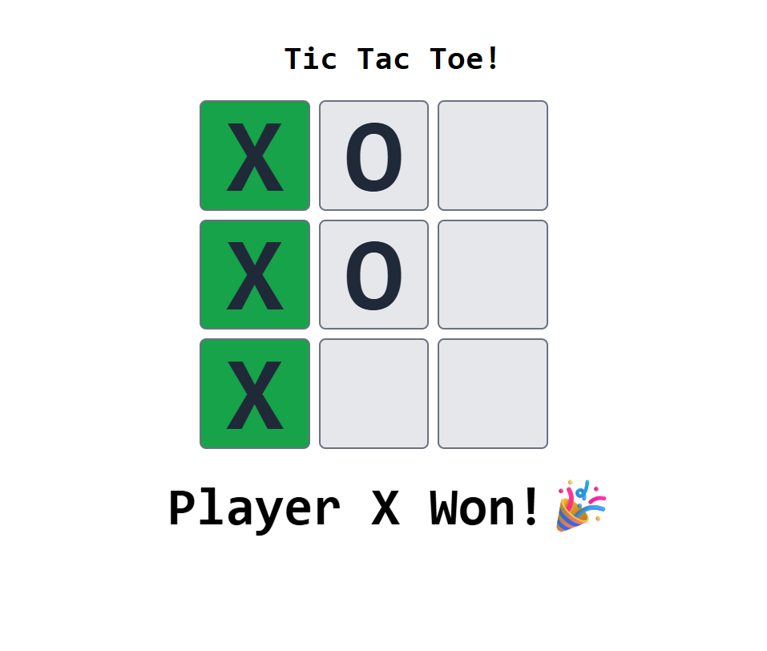

# Tic Tac Toe Game

Two players can play at a time. Turns will alternate between them, and each player must select one box. The chosen box will be marked with either an X or an O symbol. To win, a player must align their symbols in a row, column, or diagonal.

# Technologies Used:

- React JS